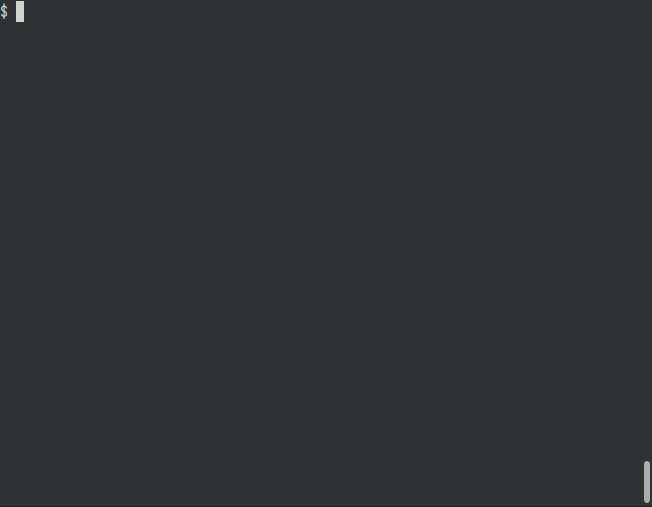

# tynx

tynx is a simple text-based web reader written in TypeScript.

* converts a web page to markdown text and renders it.
* supports vim-like cursor movement.



## Installation

```sh
$ npm install -g tynx
```

## Usage

```sh
$ tynx https://example.com
```

## Commands

* Cursor movement
  * `h`: move cursor left
  * `j`: move cursor down
  * `k`: move cursor up
  * `l`: move c rsor right
  * `0`: jump to the start of the line
  * `$`: jump to the end of the line
  * `g`: go to the first line of the document
  * `G`: go to the last line of the document
  * `Ctrl-f`: move forward one full screen
  * `Ctrl-b`: move back one full screen

* Navigation
  * `f`: follow the link under the cursor
  * `e`: enter a url and follow it
  * `r`: reload the document
  * `]`: navigate to the next page in history
  * `[`: navigate to the previous page in history
  * `H`: open history

* Other commands
  * `q`: quit
  * `?`: open help
